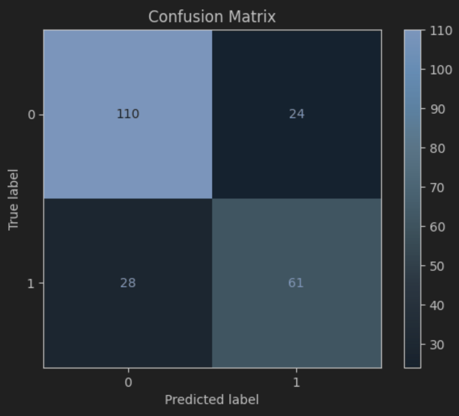

# Titanic Predictor 🚢

A machine learning project that predicts passenger survival on the Titanic dataset.

## Features
- Data preprocessing (handling missing values, feature engineering)
- Models: Logistic Regression, Decision Tree, Random Forest, XGBoost
- Hyperparameter tuning with GridSearchCV
- Visualizations (matplotlib)
- Confusion matrix evaluation

## Project Structure
- `notebooks/Titanic.ipynb` → Main notebook
- `data/` → Training & test CSVs (from Kaggle Titanic dataset)
- `requirements.txt` → Dependencies

## How to Run
1. Clone this repo
2. Install dependencies:
    
        pip install -r requirements.txt

3. Open the notebook:
    
        jupyter notebook notebooks/Titanic.ipynb

## Results

Using 5-fold cross-validation:

- **Logistic Regression** → ~78% accuracy  
  * Best params: `C=0.046`, imputer strategy=`median`

- **Decision Tree** → ~79% accuracy  
  * Best params: `max_depth=10`, `min_samples_split=2`

- **Random Forest** → ~81% accuracy  
  * Best params: `n_estimators=100`, `max_depth=10`

- **XGBoost** → ~81% accuracy  
  * Best params: `n_estimators=200`, `max_depth=3`, `learning_rate=0.2`

📊 Among these, **XGBoost performed the best** with ~81.1% accuracy.

## Model Evaluation

Confusion matrix for the best model (XGBoost):

---
